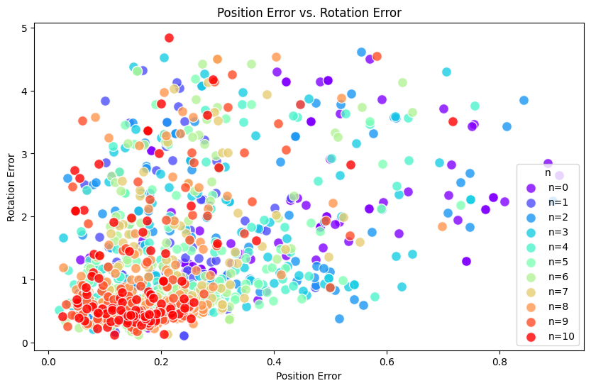
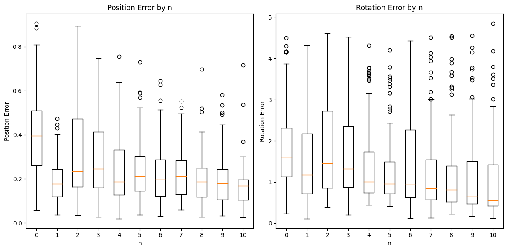

# PyTorch Robot Kinematics - Initial Interpolation Investigation

### Installation
```shell
pip install pytorch-kinematics
```

To see more about the original repository, see this link: https://github.com/UM-ARM-Lab/pytorch_kinematics

For development, clone repository somewhere, then `pip3 install -e .` to install in editable mode.

### Statement of Purpose
This branch represents an initial attempt to modify UM-ARM-Lab's Pytorch Kinematics Repository to interpolate *n* poses along a trajectory and solve inverse kinematics between interpolated poses rather than only calculate inverse kinematics from an initial pose to a goal pose. It also makes modifications to scale down testing to single robots for testing purposes. 

### Changes Made
* Scaling down test_inverse_kinematics.py to one simulated robot rather than several hundred.
* Windows Compatability
* SLERP implementation in slerp.py
* Interpolation of pose Transform3d Vectors in test_inverse_kinematics.py
* Batch Solving the inverse kinematics between *n* interpolated poses and displaying the steps
* Data collection functionality

### Analysis
Data was collected and analyzed to see if the implemented interpolation made a statistically significant difference (and was better) than the current implementation. Pose Error (Meters) and Rotation Error (Radians) were used as metrics for evaluation.   

#### Data was in the following format:
Position_Error	Rotation_Error	n	Max_Iterations
0	0.182549	3.048403	0	10
1	0.620945	1.737529	0	3
2	0.405104	4.298621	0	3
3	0.492345	2.005253	0	3

#### The following summary statistics were generated for the data:
| n  | Pos_Err_Mean | Pos_Err_Std | Pos_Err_Min | Pos_Err_Max | Rot_Err_Mean | Rot_Err_Std | Rot_Err_Min | Rot_Err_Max |
|----|--------------|-------------|-------------|-------------|--------------|-------------|-------------|-------------|
| 0  | 0.40         | 0.20        | 0.06        | 1.09        | 1.75         | 1.06        | 0.15        | 4.69        |
| 1  | 0.20         | 0.10        | 0.02        | 0.73        | 1.64         | 1.04        | 0.06        | 4.50        |
| 2  | 0.31         | 0.19        | 0.02        | 0.89        | 1.75         | 1.05        | 0.06        | 5.38        |
| 3  | 0.27         | 0.17        | 0.01        | 0.94        | 1.61         | 1.02        | 0.09        | 5.13        |
| 4  | 0.25         | 0.15        | 0.02        | 1.03        | 1.49         | 1.03        | 0.09        | 5.10        |
| 5  | 0.24         | 0.14        | 0.01        | 0.89        | 1.39         | 1.00        | 0.09        | 5.26        |
| 6  | 0.23         | 0.13        | 0.01        | 0.87        | 1.35         | 1.03        | 0.08        | 5.46        |
| 7  | 0.21         | 0.12        | 0.02        | 0.89        | 1.23         | 0.97        | 0.08        | 5.04        |
| 8  | 0.20         | 0.12        | 0.01        | 0.88        | 1.14         | 0.94        | 0.09        | 5.18        |
| 9  | 0.19         | 0.10        | 0.02        | 0.89        | 1.08         | 0.93        | 0.04        | 5.02        |
| 10 | 0.18         | 0.10        | 0.02        | 0.80        | 1.01         | 0.90        | 0.07        | 5.36        |

#### ANOVA was run to evaluate if the differences were statistically significant:
ANOVA for Position Error: F-statistic = 25.16, p-value = 3.3028936671062676e-43
There is a statistically significant difference in Position Error between the different values of n.
ANOVA for Rotation Error: F-statistic = 7.03, p-value = 9.094845564557969e-11
There is a statistically significant difference in Rotation Error between the different values of n.

#### Plots
Plotting Position Error vs Rotation Error with varying n interpolated poses, we can see that generally more interpolated poses create less position error and rotation error.



Plotting Box Plots for position error and rotation error for each n shows us a similar result. More interpolated poses is generally better.


